# k-proposal-pptx

> **[CHATdaeri](https://github.com/chatdaeri)가 만든 Claude Code 플러그인입니다.**
> [seulee26/mckinsey-pptx](https://github.com/seulee26/mckinsey-pptx)에서 영감을 받아,
> 한국 비즈니스 현장에 맞게 처음부터 새로 설계했습니다.
>
> 맥킨지 리포트가 글로벌 컨설팅(결론먼저·전략 분석 위주)라면,
> 이 플러그인은 **한국식 제안서 문법**으로 만들어졌습니다.
> 예산안·팀 소개·AS-IS/TO-BE·분기 실행계획처럼 국내 B2B 영업·기획 현장에서
> 실제로 쓰는 슬라이드 구성을 기본값으로 탑재했고,
> 브랜드 컬러(오렌지)·Pretendard 한국어 폰트·한국식 스토리 아크(표지→분석→예산→마무리)를
> 처음부터 내장합니다.


---

## 어떻게 쓰는 건가요?

텍스트로 지시하면 `.pptx` 파일이 나옵니다. 그게 전부예요.

"DX 솔루션 도입 제안서 12장, 예산안이랑 팀 소개 포함해서 만들어줘" → 30초~1분 안에 `output/` 폴더에 완성 파일이 생깁니다.

39개 슬라이드 템플릿이 들어 있고, Claude가 내용에 맞게 알아서 골라줍니다. 파워포인트 감각이 없어도, 디자인을 몰라도 됩니다.

---

## 설치하는 법

### 1단계. Claude Code 켜기

아직 없다면 [claude.ai/code](https://claude.ai/code)에서 받으세요. Mac · Windows · Linux 전부 됩니다.

### 2단계. 플러그인 마켓플레이스 등록

Claude Code 채팅창에 입력하세요:

```
/plugin marketplace add chatdaeri/k-proposal-pptx
```

### 3단계. 플러그인 설치

```
/plugin install k-proposal-pptx@chatdaeri
```

### 4단계. 의존성 설치

설치 후 안내되는 명령어를 실행하면 Playwright Chromium 등이 자동으로 깔립니다. 2~3분 걸려요.

미리보기 기능이 필요하면 아래도 설치하세요(선택):

```bash
# macOS
brew install --cask libreoffice && brew install poppler

# Ubuntu
sudo apt install libreoffice poppler-utils
```

### 5단계. 껐다 켜서 확인

Claude Code를 완전히 종료하고 다시 실행하세요.
채팅창에 `/k-proposal` 입력했을 때 자동완성이 뜨면 설치 완료입니다.

---

## 실제로 쓰는 법

### 📌 기본 흐름

**① 작업 폴더 만들고 원본 파일 넣기**

```
my-proposal/
└── inputs/
    ├── 시장조사.xlsx
    ├── 기획안.docx
    └── 로고.png
```

**② 그 폴더에서 Claude Code 열기**

```bash
cd ~/Desktop/my-proposal && claude
```

Claude가 그 폴더 안에 있어야 원본 파일을 읽을 수 있어요.

**③ 말하기**

```
inputs/ 폴더 자료로 DX 도입 제안서 12장 만들어줘. 예산안과 팀 소개 포함.
```

**④ 기다리면 완성**

`output/` 폴더에 `.pptx` 파일이 만들어집니다.

---

### 슬래시 명령어

```
/k-proposal "분기 사업 리뷰 10장으로 만들어줘"
```

### 이런 말도 알아듣습니다

- "맥킨지 스타일 한국 제안서 만들어줘"
- "DX 도입 제안서 9장, 예산안 포함"
- "AS-IS/TO-BE 비교 슬라이드 넣어줘"
- "실행 로드맵 간트 차트로 보여줘"
- "팀 소개는 조직도로, 예산은 표로 정리해줘"

### 수정도 말로 하면 됩니다

첫 결과가 마음에 안 들면 채팅 그대로 이어가면 됩니다.

```
슬라이드 4 레이아웃 바꿔줘. 숫자 비교가 더 잘 보이게.
예산표에 1분기 컬럼 추가해줘.
전체 톤 더 단정하게. 느낌표 다 빼줘.
```

---

## 슬라이드 카탈로그 (39개)

### 구조

| 템플릿 | 쓰는 상황 |
|---|---|
| `cover` | 첫 장 — 회사명 + 문서 종류 + 핵심 카피 |
| `toc` | 목차 — 섹션 3~7개 |
| `divider` | 챕터 구분 / 마지막 페이지 ("감사합니다" · Q&A) |

### 강조·결론

| 템플릿 | 쓰는 상황 |
|---|---|
| `emphasis-hero` | 분석 한 줄 결론, 풀스크린 대형 타이포 |
| `as-is-to-be` | 현재 → 제안 전후 비교, 화살표 포함 |

### 분석 프레임워크

| 템플릿 | 쓰는 상황 |
|---|---|
| `matrix-2x2` | 2×2 사분면 — 시급성×중요도, BCG, Effort×Impact |
| `bubble-chart` | 산점도 5~8개 항목, 점 크기로 3차원 표현 |
| `concept-tree` | 이슈 트리, 전략 위계 분해 (가로 트리) |

### 본문

| 템플릿 | 쓰는 상황 |
|---|---|
| `content-grid` | 4개 항목 2×2 격자 |
| `content-text-only` | 1 메인 + 3 서브 텍스트 블록 |
| `content-split` | 좌 큰 제목 + 우 단락 |
| `content-2-col-cards` | 2카드 비교 (A안/B안) |
| `content-3-col-cards` | 3카드 병렬 (솔루션 3가지 등) |

### 이미지

| 템플릿 | 쓰는 상황 |
|---|---|
| `content-hero-image` | 이미지 1개 크게 (스크린샷, 다이어그램) |
| `content-2-image-row` | 이미지 2개 나란히 |
| `content-3-image-strip` | 이미지 3개 나란히 |
| `image-left-label-blocks` | 좌 이미지 + 우 라벨 3~5개 |

### 실행 계획

| 템플릿 | 쓰는 상황 |
|---|---|
| `timeline` | 마일스톤 5점 — 날짜 + 이름 + 내용 |
| `gantt-chart` | 워크스트림 × 주간 막대, Today 마커 |
| `step-cards` | 단계 4개 가로 카드 |
| `numbered-steps-split` | 좌 큰 타이틀 + 우 단계 3~5 |
| `numbered-circle-list` | 세로 리스트 5~10개 (단계, 명단) |

### 인력·팀

| 템플릿 | 쓰는 상황 |
|---|---|
| `org-chart` | 조직도 — CEO → 부서 → 팀원 |
| `instructor-profile` | 핵심 인력 1명 상세 프로필 |

### 목록

| 템플릿 | 쓰는 상황 |
|---|---|
| `faq-list` | Q&A 3~5쌍 — 예상 질의 정리 |
| `tool-card-grid` | 도구·솔루션 6~8개 카탈로그 |

### 데이터 시각화

| 템플릿 | 쓰는 상황 |
|---|---|
| `combo-bar-line` | 시계열 막대+선 콤보 차트 |
| `two-up-charts` | 좌·우 다른 차트 2개로 대비 |
| `bar-table` | 막대 차트 + 우측 정확한 숫자 표 |
| `donut-chart` | 비율 도넛 차트 (4 세그먼트) |
| `budget-table` | 예산 표 + 합계 + 운영안 2가지 |

> 토큰 명세 및 슬라이드 선택 기준은 [`skills/proposal/CATALOG.md`](skills/proposal/CATALOG.md)

> *컬러 및 로고 수정 가능

### 미리보기

**구조 — cover · toc · divider**

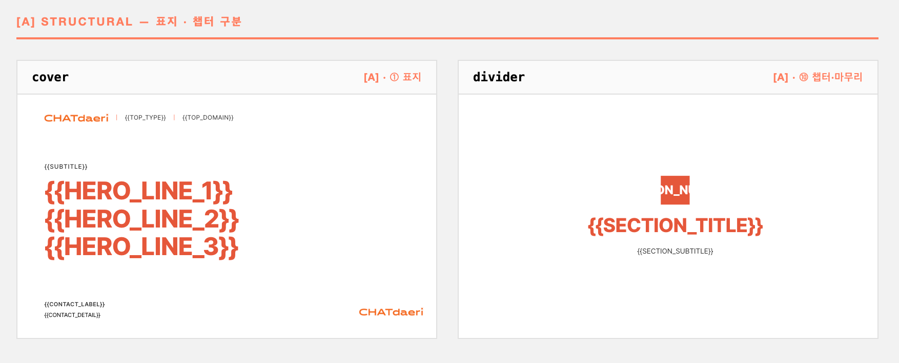

**강조·결론 — emphasis-hero**

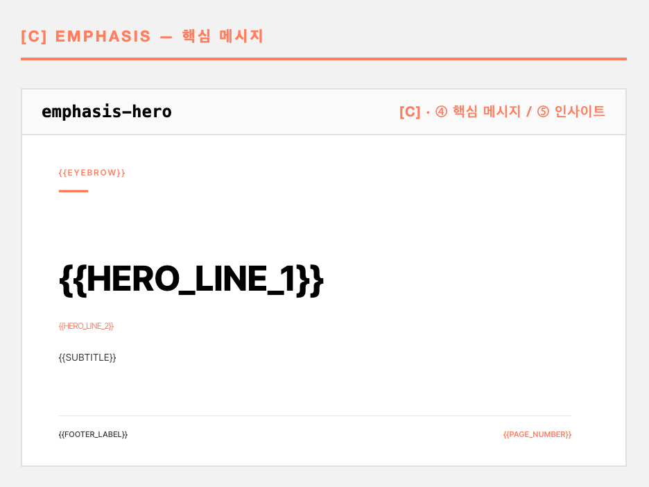

**분석 프레임워크 — matrix-2x2 · bubble-chart · concept-tree**

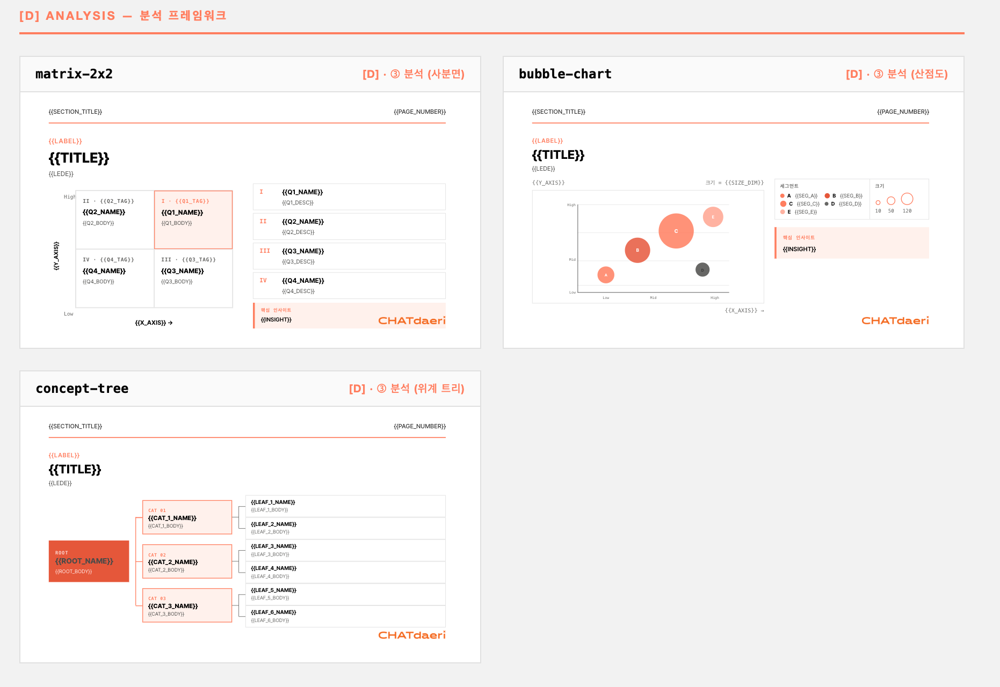

**본문 (1) — content-grid · content-text-only · content-split · content-2-col-cards**

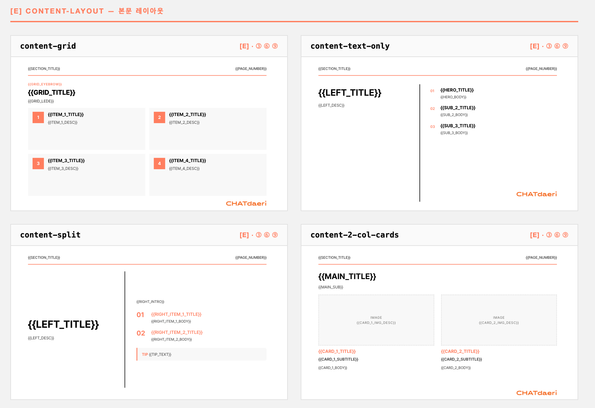

**본문 (2) — content-3-col-cards · as-is-to-be**

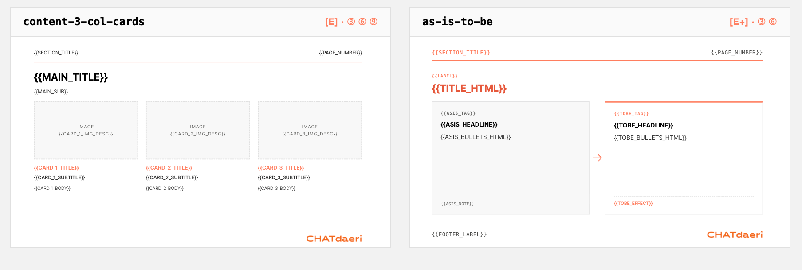

**이미지 (1) — content-hero-image · content-2-image-row · content-3-image-strip · image-left-label-blocks**

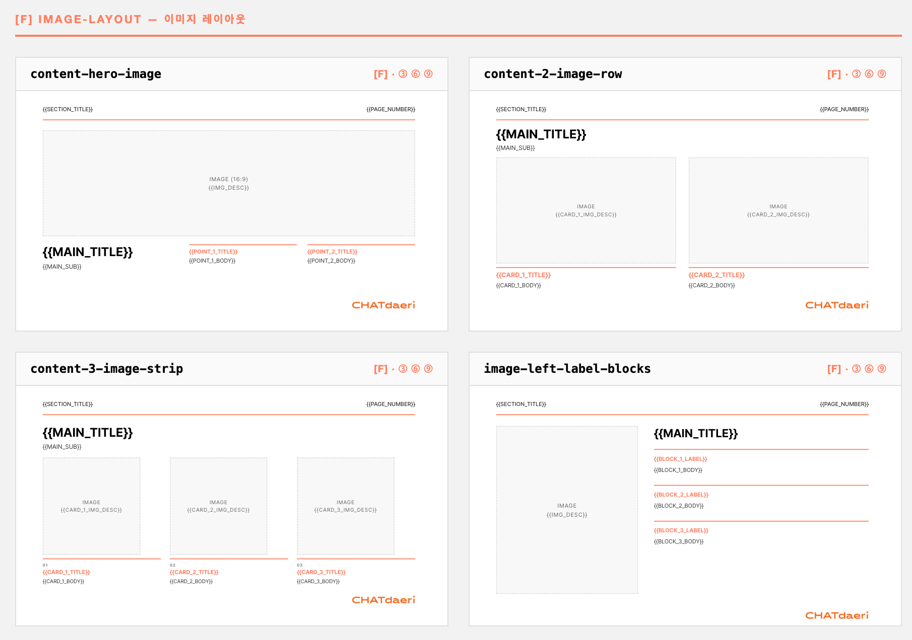

**이미지 (2) — news-clipping · product-screenshot**

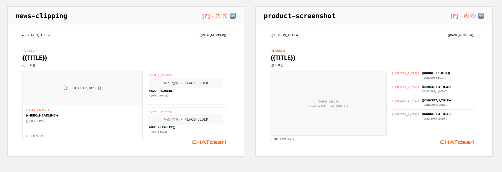

**실행 계획 (1) — timeline · gantt-chart · step-cards · numbered-steps-split**

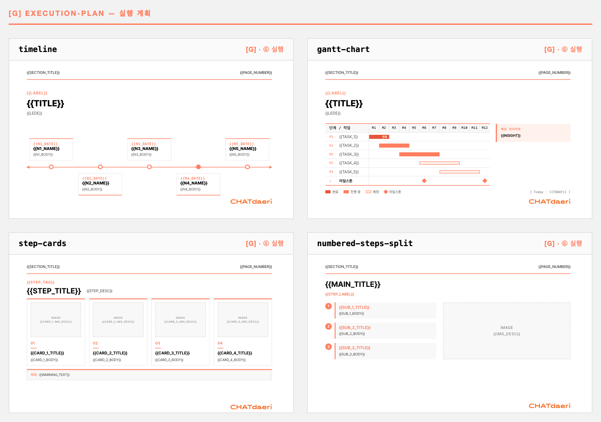

**실행 계획 (2) · 인력·팀 — numbered-circle-list · org-chart · instructor-profile**

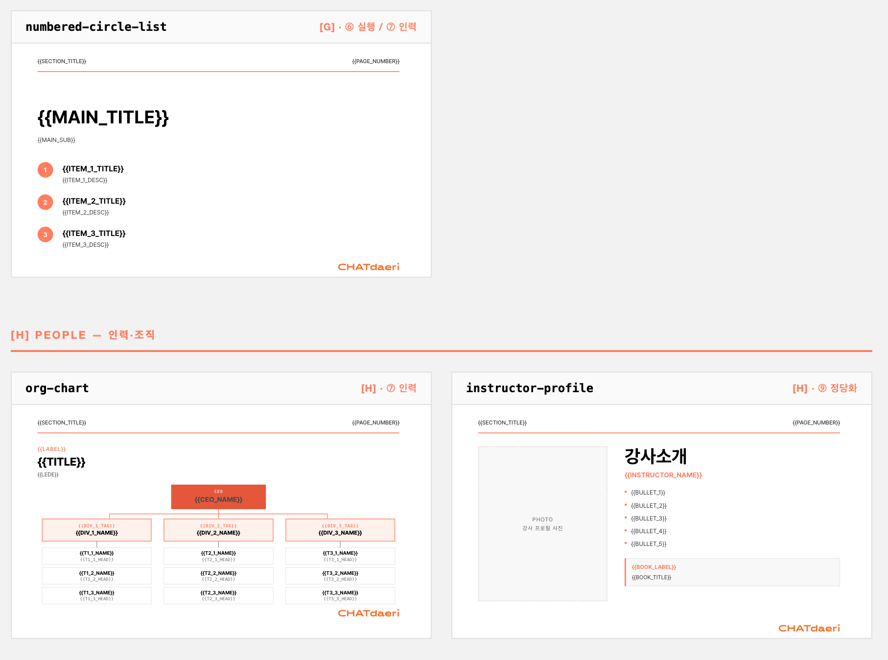

**목록 — faq-list · tool-card-grid · areas-list · icon-grid**

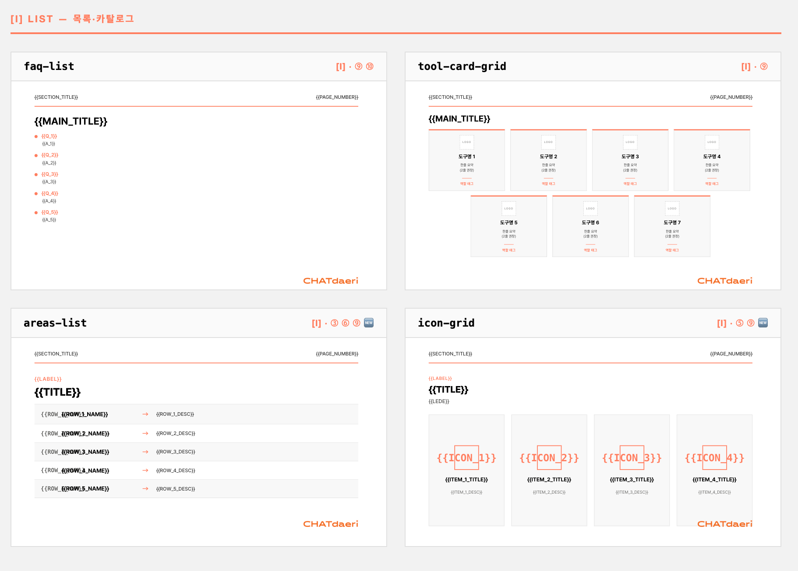

**데이터 시각화 (1) — combo-bar-line · two-up-charts · bar-table · donut-chart**

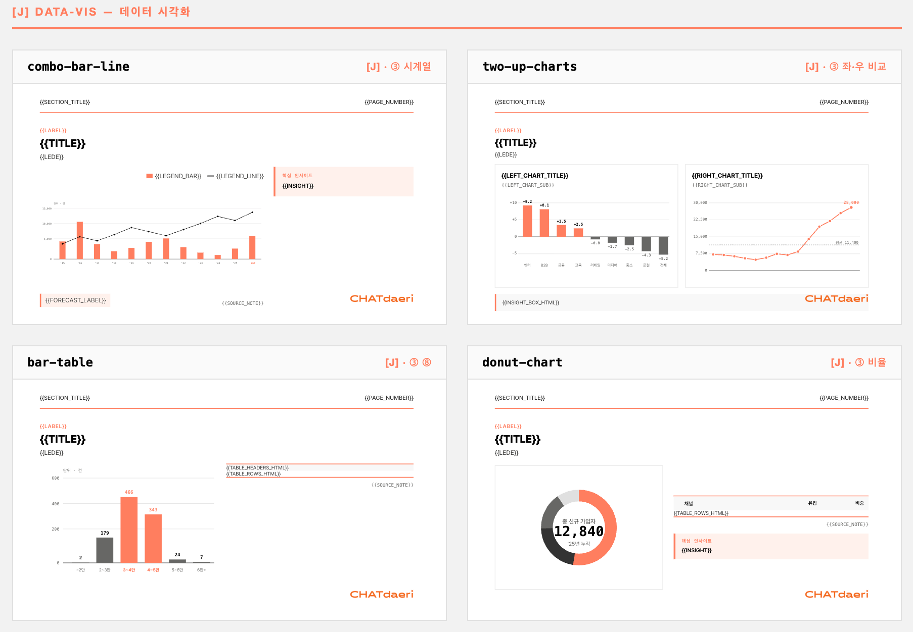

**데이터 시각화 (2) — budget-table · bar-graph · chart-donut · two-up-charts-bar**

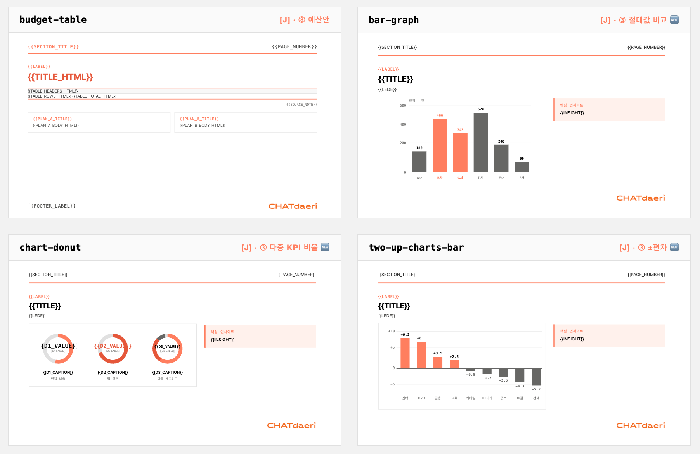

**데이터 시각화 (3) — two-up-charts-line**

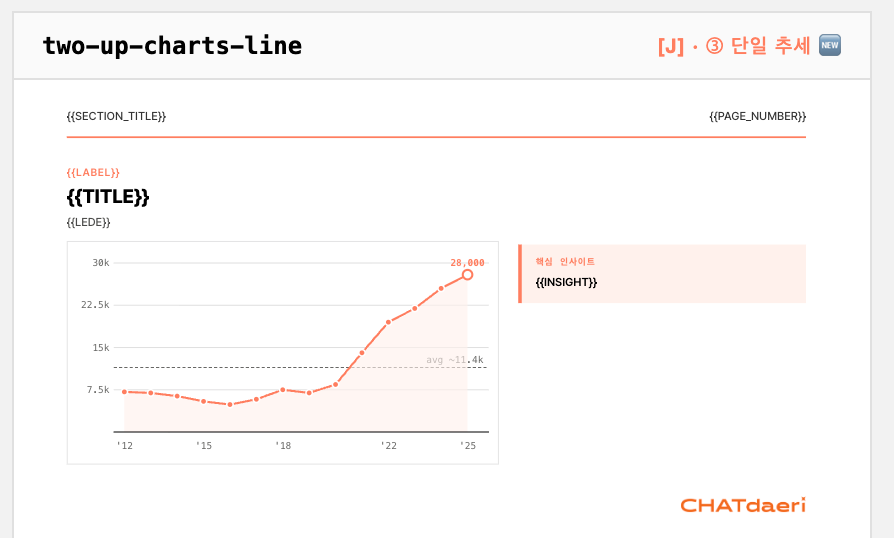

---

## 한국식 스토리 아크

12~18장짜리 제안서를 이 흐름으로 자동 구성합니다. 개별 슬라이드만 뽑을 수도 있어요.

| 슬롯 | 역할 | 주로 쓰는 템플릿 |
|---|---|---|
| ① 표지 | 회사·문서·카피 | `cover` |
| ② 목차 | 전체 구성 | `toc` |
| ③ 분석 1~5장 | 현황·문제·근거 데이터 | 차트·매트릭스·본문 |
| ④ 핵심 메시지 | 한 줄 결론 | `emphasis-hero` |
| ⑤ 핵심 인사이트 | 데이터가 말하는 것 | `emphasis-hero` · `content-grid` |
| ⑥ 실행 방안 | 로드맵·단계·간트 | `timeline` · `gantt-chart` · `step-cards` |
| ⑦ 인력 구성 | 팀·조직도 | `org-chart` · `instructor-profile` |
| ⑧ 예산안 | 비용·분기·운영안 | `budget-table` |
| ⑨ 정당화 | 사례·도구·신뢰도 | 이미지·카드·차트 |
| ⑩ 마무리 | 감사·Q&A | `divider` · `emphasis-hero` · `faq-list` |

---

## 예시 모음

| | 장수 | 내용 |
|---|---|---|
| `examples/01-real-estate-proposal/` | 9장 | 가상 오피스텔 분양성 검토 |
| `examples/02-dx-proposal/` | 9장 | B2B DX 솔루션 도입 제안 |
| `examples/03-conference-branding/` | 8장 | 브랜드 컨퍼런스 기획 제안 |

직접 빌드해서 결과 확인:

```bash
node skills/proposal/scripts/build.cjs examples/02-dx-proposal/deck.cjs --no-lint
```

---

## 자주 묻는 것들

**코딩 전혀 모르는데 써도 되나요?**
됩니다. Claude Code만 설치하면 전부 한국어 대화로 끝나요.

**회사 자료 올려도 안전한가요?**
파일은 내 컴퓨터 안에서만 처리됩니다. 외부에 업로드되지 않아요. (Claude와의 대화 내용은 AI 응답을 위해 Anthropic 서버에 전달됩니다. 회사 보안 정책 확인 후 사용하세요.)

**장 수 지정할 수 있나요?**
됩니다. "12장으로", "9슬라이드로" 라고 하면 됩니다.

**레이아웃이 마음에 안 들면요?**
"이 슬라이드 레이아웃 바꿔줘"라고 하면 됩니다. 39개 중 다른 걸 골라 다시 그려줘요.

**로고 교체 가능한가요?**
됩니다. `inputs/` 폴더에 `로고.png`(또는 `logo.png`, `logo.svg`)를 넣으면 모든 슬라이드의 로고가 자동으로 교체됩니다.

**완성 파일 편집 가능한가요?**
일반 `.pptx` 파일이에요. 파워포인트·Keynote로 바로 열어서 편집하면 됩니다.

---

## 구성

```
k-proposal-pptx/
├── .claude-plugin/         ← Claude Code가 읽는 플러그인 정보
├── agents/                 ← k-proposal-agent 정의
├── commands/               ← /k-proposal 슬래시 커맨드
├── skills/proposal/        ← PPT 엔진 (39개 템플릿)
│   ├── layouts/
│   ├── components/
│   ├── fonts/              ← Pretendard Variable
│   └── tokens/
├── examples/               ← 샘플 덱 3종
└── scripts/
```

---

## 기여·문의

이슈·PR: [github.com/chatdaeri/k-proposal-pptx/issues](https://github.com/chatdaeri/k-proposal-pptx/issues)

---

## 라이선스

[MIT](./LICENSE) © 2026 Synergy Labs — 챗대리 (CHATdaeri)

Inspired by [mckinsey-pptx by seulee26](https://github.com/seulee26/mckinsey-pptx).
